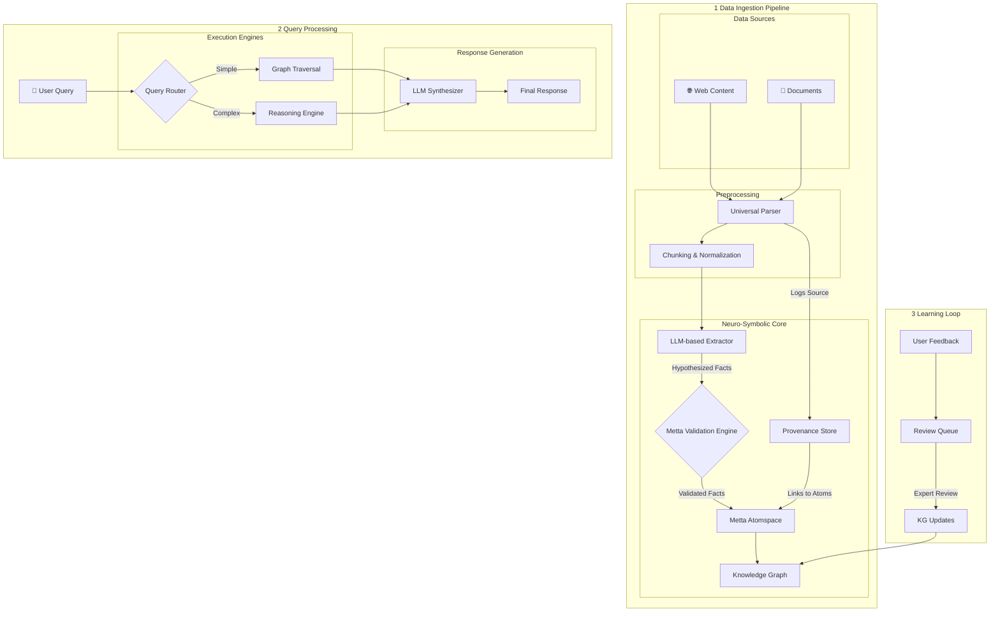

# Project Athena: Neuro-Symbolic Knowledge Engine

> **Mission**: Build a domain-specific FAQ chatbot that combines the power of knowledge graphs with large language models to deliver accurate, contextual, and verifiable answers.

## 1. The Challenge

Traditional FAQ systems struggle with:
- **Lack of Context**: Unable to understand relationships between concepts
- **Shallow Responses**: Provide generic answers without domain depth
- **Knowledge Silos**: Information remains disconnected and unstructured
- **Static Knowledge**: Difficult to update with new information

## 2. The Athena Solution

### Neuro-Symbolic Architecture
Athena combines neural networks with symbolic AI to create a hybrid system that's both powerful and trustworthy:

- **Neural Core**: Uses LLMs for pattern recognition and information extraction
- **Symbolic Core**: Leverages Metta for logical validation and reasoning
- **Dynamic Knowledge Graph**: Stores interconnected facts with full provenance

### Key Innovations

#### 1. Two-Phase Knowledge Processing
1. **Extraction**: LLMs identify potential facts from unstructured text
2. **Validation**: Facts are verified against existing knowledge and domain rules

#### 2. Self-Correcting Knowledge Base
- Automatic conflict detection and resolution
- Human-in-the-loop validation for critical updates
- Full audit trail of all changes

#### 3. Explainable AI
- Every answer includes:
  - Source documents
  - Reasoning path
  - Confidence scores

## 3. Core Features

### 🤖 Domain-Specific Understanding
- **Fine-tuned LLMs**: Specialized in your industry's terminology
- **Context-Aware Responses**: Understands domain-specific relationships
- **Multi-turn Conversations**: Maintains context across queries

### 🧠 Knowledge Graph Integration
- **Graph RAG**: Combines retrieval with graph traversal
- **Relationship Mapping**: Visualizes connections between concepts
- **Dynamic Updates**: Real-time knowledge graph evolution

### 🔍 Advanced Query Processing
- **Multi-hop Reasoning**: Follows relationships across the knowledge graph
- **Contextual Understanding**: Maintains conversation history
- **Source Attribution**: Provides traceable responses

### 🛠️ Developer Friendly
- **RESTful API**: Easy integration with existing systems
- **Customizable**: Adapt to any domain or use case
- **Extensible**: Add new knowledge sources and processing modules

## 4. System Architecture



### Key Components

1. **Data Ingestion Pipeline**
   - Handles multiple data formats
   - Normalizes and chunks content
   - Extracts and validates knowledge

2. **Query Processing**
   - Natural language understanding
   - Multi-hop reasoning
   - Explainable responses

3. **Learning Loop**
   - Continuous improvement
   - Human-in-the-loop validation
   - Knowledge refinement

Layer 1: Ingestion: A universal parser accepts data from various sources, normalizing it for processing. The raw source content and its metadata are immediately logged in the Source Index.

Layer 2: Conversion Core: The parsed content is fed to the LLM Core, which extracts potential facts (hypotheses) as triples or other structures. These hypotheses are passed to the Metta Rules Engine, which checks them for logical consistency, validates them against the domain schema, and formalizes them into Metta atoms.

Layer 3: Living Knowledge Base: The validated facts (atoms) are committed to the Metta Atomspace. This is a transactional update, ensuring the graph remains consistent. A link is created between the new atom and its entry in the Source Index, completing the provenance chain.

Layer 4: Reasoning: A user query enters the Graph RAG Engine. It performs semantic and graph-based retrieval to assemble a relevant subgraph of facts. The Explainability Module uses this subgraph to construct a human-readable answer and simultaneously traces the logical path and sources used.

Layer 5: Output: The final answer is delivered to the user, complete with the option to inspect the underlying sources and the reasoning path for full verification.

4.2. Cyclical Knowledge Ingestion & Validation Loop
This diagram details the most novel part of Athena: a self-correcting loop that ensures data integrity and prevents the propagation of errors.

graph TD
    A[Raw Text Chunk] --> B{1. Hypothesis Generation<br/>(LLM Extraction)};
    B -- "Potential Fact<br/>(e.g., 'Paris-capitalOf-France')" --> C(2. Symbolic Formulation<br/>(Translate to Metta Atom));

    subgraph "Validation Cycle"
        C --> D{3. Consistency Check};
        D -- "Query Existing Knowledge" --> E(Metta Atomspace);
        E -- "Return Related Facts" --> D;
    end
    
    D -- "✅ No Conflict<br/>Fact is Consistent" --> F(4a. Integrate & Index);
    F -- "Commit New Atom" --> E;
    F -- "Link Atom to Source Text" --> G[Source Provenance DB];
    A --> G;

    D -- "❌ Conflict Detected<br/>Fact is Contradictory" --> H{4b. Refinement & Feedback};
    H -- "Re-prompt LLM with Context<br/>'This contradicts X...'" --> B;

    style D fill:#ffebee,stroke:#c62828,stroke-width:2px
    style H fill:#fff9c4,stroke:#f9a825,stroke-width:2px

Hypothesis Generation: The LLM reads a text chunk and extracts a potential fact (a hypothesis). For instance, it might extract (headquartered-in SpaceX "Hawthorne").

Symbolic Formulation: This hypothesis is translated into a formal Metta atom, ready for logical evaluation.

Consistency Check: The system queries the existing Atomspace for any facts related to SpaceX and headquartered-in. Let's say it finds an existing fact: (headquartered-in SpaceX "Boca Chica").

Integration or Refinement:

No Conflict: If no conflicting facts exist, the new fact is integrated into the Atomspace and linked to its source in the Provenance DB.

Conflict Detected: The system identifies a contradiction. Instead of blindly overwriting or ignoring it, it triggers the feedback loop. It re-prompts the LLM with a more specific query, such as: "The system knows (headquartered-in SpaceX "Boca Chica"). You have just extracted (headquartered-in SpaceX "Hawthorne") from the new document. Review both sources and clarify the relationship. Is Hawthorne a secondary headquarters or is the information outdated?" This allows the LLM to make a more nuanced, context-aware decision, dramatically improving the quality and accuracy of the knowledge base over time.

5. The Athena Advantage: A Paradigm Shift
Adopting Athena is not an incremental improvement; it is a fundamental shift from using AI as a probabilistic text generator to leveraging it as a deterministic reasoning engine. This new paradigm offers transformative benefits across the entire enterprise.

Aspect

Current LLM-Based Systems

Project Athena

The Benefit

Truth Model

Generative Plausibility

Symbolic Verification

Unprecedented Trust & Reliability

Context

Shallow Retrieval

Deep Relational Reasoning

Actionable Insights, Not Just Summaries

Knowledge

Static & Stale

Dynamic & Real-Time

Always Current & Adaptive

Consistency

Non-Deterministic

Deterministic & Predictable

Repeatable & Auditable for Business Processes

Debugging

"Black Box" Problem

Transparent & Correctable

Rapid Error Correction & Maintainability

Efficiency

High Computational Cost

Low Query Cost

Massive Cost Savings & Scalability

Knowledge Asset

Implicit & Unstructured

Explicit & Structured

Creates a Permanent, Strategic Knowledge Base

Security

API-Dependent

Self-Hosted & Sovereign

Total Data Control & Security

## 5. Technology Stack

### Core Components
- **Reasoning Engine**: Metta Language
- **Knowledge Storage**: MeTTa Atomspace
- **Neural Processing**: Domain-Adapted LLM Pipeline
  - Fine-tuned for domain-specific terminology
  - Specialized in relationship extraction
  - Context-aware response generation
- **Knowledge Graph Integration**:
  - Real-time graph traversal
  - Relationship-aware query processing
  - Dynamic fact verification
- **API Layer**: FastAPI for seamless integration
- **Frontend**: Interactive chat interface with response visualization

### Development Tools
- **Version Control**: Git
- **CI/CD**: GitHub Actions
- **Containerization**: Docker
- **Orchestration**: Kubernetes (for production)

## 6. Getting Started

### Prerequisites
- Python 3.9+
- Docker
- Git

### Installation
```bash
# Clone the repository
git clone https://github.com/your-org/athena.git
cd athena

# Set up virtual environment
python -m venv venv
source venv/bin/activate  # On Windows: venv\Scripts\activate

# Install dependencies
pip install -r requirements.txt
```

### Running Locally
```bash
# Start the backend API
uvicorn app.main:app --reload

# Start the frontend
cd frontend && npm start
```

## 7. Contributing

We welcome contributions! Please see our [Contributing Guidelines](CONTRIBUTING.md) for details.

## 8. License

This project is licensed under the MIT License - see the [LICENSE](LICENSE) file for details.

## 9. Acknowledgements

- The MeTTa community for their amazing symbolic reasoning framework
- The open-source AI/ML community for their invaluable contributions
- Our early adopters for their feedback and support